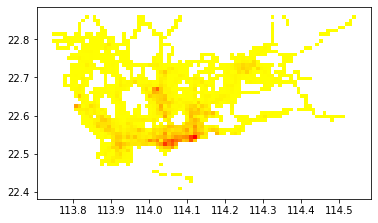
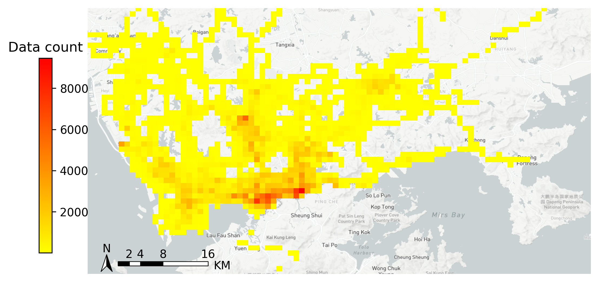

English [中文版](README-zh_CN.md)

# TransBigData


[](https://transbigdata.readthedocs.io/en/latest/?badge=latest) [](https://badge.fury.io/py/transbigdata)   [](https://space.bilibili.com/3051484)  

## Introduction

`TransBigData` is a Python package developed for transportation spatio-temporal big data processing, analysis and visualization. `TransBigData` provides fast and concise methods for processing common transportation spatio-temporal big data such as Taxi GPS data, bicycle sharing data and bus GPS data. `TransBigData` provides a variety of processing methods for each stage of transportation spatio-temporal big data analysis. The code with `TransBigData` is clean, efficient, flexible, and easy to use, allowing complex data tasks to be achieved with concise code.   

For some specific types of data, `TransBigData` also provides targeted tools for specific needs, such as extraction of Origin and Destination(OD) of taxi trips from taxi GPS data and identification of arrival and departure information from bus GPS data. The latest stable release of the software can be installed via pip and full documentation
can be found at https://transbigdata.readthedocs.io/en/latest/.

### Technical Features

* Provide a variety of processing methods for each stage of transportation spatio-temporal big data analysis.
* The code with `TransBigData` is clean, efficient, flexible, and easy to use, allowing complex data tasks to be achieved with concise code.

### Main Functions

Currently, `TransBigData` mainly provides the following methods:  

* **Data Quality**: Provides methods to quickly obtain the general information of the dataset, including the data amount the time period and the sampling interval.  
* **Data Preprocess**: Provides methods to clean multiple types of data error.   
* **Data Gridding**: Provides methods to generate multiple types of geographic grids (Rectangular grids, Hexagonal grids) in the research area. Provides fast algorithms to map GPS data to the generated grids.   
* **Data Aggregating**: Provides methods to aggregate GPS data and OD data into geographic polygon.  
* **Data Visualization**: Built-in visualization capabilities leverage the visualization package keplergl to interactively visualize data on Jupyter notebook with simple code.  
* **Trajectory Processing**: Provides methods to process trajectory data, including generating trajectory linestring from GPS points, and trajectory densification, etc.  
* **Basemap Loading**: Provides methods to display Mapbox basemap on matplotlib figures


## Installation

Before installing `TransBigData`, make sure that you have installed the available geopandas package: https://geopandas.org/index.html
If you already have geopandas installed, run the following code directly from the command prompt to install `TransBigData`

    pip install -U transbigdata

## Example of usage

The following example shows how to use the `TransBigData` to perform data gridding, data aggregating and data visualization for taxi GPS data.

### Read the data

```python
import transbigdata as tbd
import pandas as pd
#Read taxi gps data  
data = pd.read_csv('TaxiData-Sample.csv',header = None) 
data.columns = ['VehicleNum','time','lon','lat','OpenStatus','Speed'] 
data
```


<div>
<table border="1" class="dataframe">
  <thead>
    <tr style="text-align: right;">
      <th></th>
      <th>VehicleNum</th>
      <th>time</th>
      <th>lon</th>
      <th>lat</th>
      <th>OpenStatus</th>
      <th>Speed</th>
    </tr>
  </thead>
  <tbody>
    <tr>
      <th>0</th>
      <td>34745</td>
      <td>20:27:43</td>
      <td>113.806847</td>
      <td>22.623249</td>
      <td>1</td>
      <td>27</td>
    </tr>
    <tr>
      <th>1</th>
      <td>34745</td>
      <td>20:24:07</td>
      <td>113.809898</td>
      <td>22.627399</td>
      <td>0</td>
      <td>0</td>
    </tr>
    <tr>
      <th>2</th>
      <td>34745</td>
      <td>20:24:27</td>
      <td>113.809898</td>
      <td>22.627399</td>
      <td>0</td>
      <td>0</td>
    </tr>
    <tr>
      <th>3</th>
      <td>34745</td>
      <td>20:22:07</td>
      <td>113.811348</td>
      <td>22.628067</td>
      <td>0</td>
      <td>0</td>
    </tr>
    <tr>
      <th>4</th>
      <td>34745</td>
      <td>20:10:06</td>
      <td>113.819885</td>
      <td>22.647800</td>
      <td>0</td>
      <td>54</td>
    </tr>
    <tr>
      <th>...</th>
      <td>...</td>
      <td>...</td>
      <td>...</td>
      <td>...</td>
      <td>...</td>
      <td>...</td>
    </tr>
    <tr>
      <th>544994</th>
      <td>28265</td>
      <td>21:35:13</td>
      <td>114.321503</td>
      <td>22.709499</td>
      <td>0</td>
      <td>18</td>
    </tr>
    <tr>
      <th>544995</th>
      <td>28265</td>
      <td>09:08:02</td>
      <td>114.322701</td>
      <td>22.681700</td>
      <td>0</td>
      <td>0</td>
    </tr>
    <tr>
      <th>544996</th>
      <td>28265</td>
      <td>09:14:31</td>
      <td>114.336700</td>
      <td>22.690100</td>
      <td>0</td>
      <td>0</td>
    </tr>
    <tr>
      <th>544997</th>
      <td>28265</td>
      <td>21:19:12</td>
      <td>114.352600</td>
      <td>22.728399</td>
      <td>0</td>
      <td>0</td>
    </tr>
    <tr>
      <th>544998</th>
      <td>28265</td>
      <td>19:08:06</td>
      <td>114.137703</td>
      <td>22.621700</td>
      <td>0</td>
      <td>0</td>
    </tr>
  </tbody>
</table>
<p>544999 rows × 6 columns</p>
</div>


### Data pre-processing

Define the study area and use the `tbd.clean_outofbounds` method to delete the data out of the study area

```python
#Define the study area
bounds = [113.75, 22.4, 114.62, 22.86]
#Delete the data out of the study area
data = tbd.clean_outofbounds(data,bounds = bounds,col = ['lon','lat'])
```

### Data gridding

The most basic way to express the data distribution is in the form of geograpic grids. `TransBigData` provides methods to generate multiple types of geographic grids (Rectangular grids, Hexagonal grids) in the research area. For rectangular gridding, you need to determine the gridding parameters at first(which can be interpreted as defining a grid coordinate system):

```python
#Obtain the gridding parameters
params = tbd.grid_params(bounds,accuracy = 1000)
```

the next step is to map the GPS data to their corresponding grids. Using the `tbd.GPS_to_grids`, it will generate the `LONCOL` column and the `LATCOL` column. The two columns together can specify a grid:

```python
#Map the GPS data to grids
data['LONCOL'],data['LATCOL'] = tbd.GPS_to_grids(data['lon'],data['lat'],params)
```

Count the amount of data in each grids, generate the geometry of the grids and transform it into a GeoDataFrame:

```python
#Aggregate data into grids
grid_agg = data.groupby(['LONCOL','LATCOL'])['VehicleNum'].count().reset_index()
#generate grid geometry
grid_agg['geometry'] = tbd.gridid_to_polygon(grid_agg['LONCOL'],grid_agg['LATCOL'],params)
#change the type into GeoDataFrame
import geopandas as gpd
grid_agg = gpd.GeoDataFrame(grid_agg)
#Plot the grids
grid_agg.plot(column = 'VehicleNum',cmap = 'autumn_r')
```


    

### Data Visualization(with basemap)

For a For a formal data visualization figure, we still have to add the basemap, the colorbar, the compass and the scale. Use `tbd.plot_map` to load the basemap and `tbd.plotscale` to add compass and scale in matplotlib figure:

```python
import matplotlib.pyplot as plt
fig =plt.figure(1,(8,8),dpi=300)
ax =plt.subplot(111)
plt.sca(ax)
#Load basemap
tbd.plot_map(plt,bounds,zoom = 11,style = 4)
#define colorbar
cax = plt.axes([0.05, 0.33, 0.02, 0.3])
plt.title('Data count')
plt.sca(ax)
#Plot the data
grid_agg.plot(column = 'VehicleNum',cmap = 'autumn_r',ax = ax,cax = cax,legend = True)
#Add scale
tbd.plotscale(ax,bounds = bounds,textsize = 10,compasssize = 1,accuracy = 2000,rect = [0.06,0.03],zorder = 10)
plt.axis('off')
plt.xlim(bounds[0],bounds[2])
plt.ylim(bounds[1],bounds[3])
plt.show()
```

    

    

## Related Links

* Bilibili:  https://space.bilibili.com/3051484
* Data analytics course for beginner https://www.lifangshuju.com/#/introduce/166  
* Transportation Big Data analysis course： https://www.lifangshuju.com/#/introduce/154  
* Data Visualization course： https://www.lifangshuju.com/#/introduce/165  
* Github for this project： https://github.com/ni1o1/transbigdata/  
* Bug report： https://github.com/ni1o1/transbigdata/issues  

