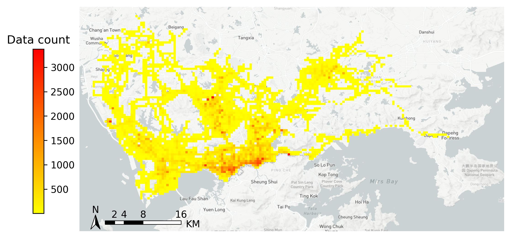

# Summary

In recent years, data generated in transportation field has begun to explode. Individual continuous tracking data, such as mobile phone data, IC smart card data, taxi GPS data, bus GPS data and bicycle sharing order data, also known as "spatio-temporal big data" or "Track &Trace data", has great potential for application in data-driven transportation research. These spatio-temporal big data typically require three aspects of information: Who? When? Where? They are characterized by high data quality, large collection scope, and fine-grained spatio-temporal information, which can fully capture the daily activities of individuals and their travel behavior in the city in both time and space dimensions. The emergence of these data provides new ways and opportunities for potential transportation demand analysis and travel mechanism understanding in supporting urban transportation planning. 

`TransBigData` is a Python package developed for transportation spatio-temporal big data processing, analysis and visualization. `TransBigData` provides fast and concise methods for processing common transportation spatio-temporal big data such as Taxi GPS data, bicycle sharing data and bus GPS data. `TransBigData` provides a variety of processing methods for each stage of transportation spatio-temporal big data analysis. The code with `TransBigData` is clean, efficient, flexible, and easy to use, allowing complex data tasks to be achieved with concise code. It has already been used in a number of scientific publications [@Pearson:2017]

For some specific types of data, `TransBigData` also provides targeted tools for specific needs, such as extraction of Origin and Destination(OD) of taxi trips from taxi GPS data and identification of arrival and departure information from bus GPS data.

Currently, `TransBigData` mainly provides the following methods:
*Data Quality*: Provides methods to quickly obtain the general information of the dataset, including the data amount the time period and the sampling interval.
*Data Preprocess*: Provides methods to clean multiple types of data error. 
*Data Gridding*: Provides methods to generate multiple types of geographic grids (Rectangular grids, Hexagonal grids) in the research area. Provides fast algorithms to map GPS data to the generated grids (\autoref{fig:fig1}). 
*Data Aggregating*: Provides methods to aggregate GPS data and OD data into geographic polygon.
*Data Visualization*: Built-in visualization capabilities leverage the visualization package keplergl to interactively visualize data on Jupyter notebook with simple code.
*Trajectory Processing*: Provides methods to process trajectory data, including generating trajectory linestring from GPS points, and trajectory densification, etc.
*Basemap Loading*: Provides methods to display Mapbox basemap on matplotlib figures (\autoref{fig:fig1})

The latest stable release of the software can be installed via pip and full documentation
can be found at https://transbigdata.readthedocs.io/en/latest/.

{ width=20% }

{ width=20% }

# Citations

Citations to entries in paper.bib should be in
[rMarkdown](http://rmarkdown.rstudio.com/authoring_bibliographies_and_citations.html)
format.

If you want to cite a software repository URL (e.g. something on GitHub without a preferred
citation) then you can do it with the example BibTeX entry below for @fidgit.

For a quick reference, the following citation commands can be used:
- `@author:2001`  ->  "Author et al. (2001)"
- `[@author:2001]` -> "(Author et al., 2001)"
- `[@author1:2001; @author2:2001]` -> "(Author1 et al., 2001; Author2 et al., 2002)"

# Figures

Figures can be included like this:

and referenced from text using \autoref{fig:example}.

Figure sizes can be customized by adding an optional second parameter:
{ width=20% }

# References
